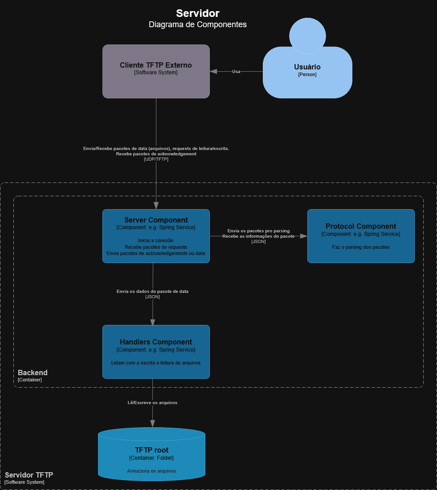

# Servidor TFTP Assíncrono em Python

Este projeto é uma implementação de um Servidor TFTP (Trivial File Transfer Protocol) assíncrono escrito em Python, utilizando comunicação via sockets UDP com a biblioteca nativa `asyncio`.

## Diagrama de Componentes



## Funcionalidades

- **Suporte a RRQ (Read Request)**: Permite que clientes baixem (download) arquivos hospedados no servidor gerenciado através do `RRQHandler`.
- **Suporte a WRQ (Write Request)**: Permite que clientes façam upload de arquivos para o servidor através do `WRQHandler`.
- **Comunicação Assíncrona**: O servidor é fundamentado na classe `asyncio.DatagramProtocol`, suportando conexões simultâneas de clientes sem bloquear as operações de I/O do processo.
- **Gerenciamento de Retransmissão**: O suporte para retransmissão no envio é contornado usando um mecanismo de controle para lidar com timeouts e perda de pacotes durante a leitura.
- **Prevenção contra Vulnerabilidade de Percurso (Path Traversal)**: Protege o sistema de arquivos validando o escopo de leitura e gravação para assegurar que clientes possuam apenas acesso à pasta raiz designada (padrão `tftp_root`).

## Estrutura do Projeto

Abaixo é descrito o design do código e o propósito de cada módulo do sistema:

- **`main.py`**: Ponto de entrada da aplicação. Inicializa o root (pasta local do sistema de arquivos) e cria o endpoint do datagrama vinculando as configurações do `TFTPConfig`.
- **`config.py`**: Centraliza as configurações contendo a porta do servidor UDP (6969 por padrão), timeout, número de tentativas (retries) e local para salvar os arquivos.
- **`/server`**:
  - `core.py`: Contém o `TFTPServerProtocol`, o núcleo de recebimento de datagramas e delegador dos `opcodes` (inicia a sessão do cliente para RRQ ou WRQ sob demanda).
  - `session.py`: Fornece a abstração de socket UDP não bloqueável de cada negociação com um cliente específico, permitindo facilidade em enviar pacote `data` ou de erro e garantindo `sys-pathing` restrito da sessão.
  - `retransmit.py`: Uma classe que gerencia tarefas assíncronas aguardando pacotes `ACK` de modo condicional, disparando reenvios caso exceda o timeout estipulado.
- **`/handlers`**:
  - `rrq.py`: Processa requisições de leitura de um arquivo. Transfere recursos sequencialmente para o cliente utilizando datagramas de tamanho restrito (ex_ 512 bytes).
  - `wrq.py`: Processa a escrita de arquivos. Geraciona fluxos onde se aguardam envios parciais em blocos e envia pacotes de confirmação (ACK) confirmando cada remessa para escrita no disco.
  - `base.py`: Ponto genérico a se herdar em classes de Handler.
- **`/protocol`**:
  - `packet.py`: Utilitário de montagem/desmontagem de protocolos. Possui métodos estáticos para criar facilmente `bytes` formatados corretos no protocolo TFTP (Acknowledgment, Errors, Data Packets, opcode parsing).
  - `options.py`: Opções adicionais propostas pelo protocolo TFTP.
- **`/services` & `/utils`**: Módulos voltados utilidade a nível de infraestrutura, tais como `logger.py` e facilidades com arquivos (`file_utils.py`, `file_service.py`).

## Visão Geral da Arquitetura

O fluxo de requisições de um cliente é despachado da seguinte maneira no back-end:

```
Pacote UDP do Cliente
        │
        ▼
TFTPServerProtocol (server/core.py) -- Despacha a requisição
  asyncio.DatagramProtocol
        │
        ▼
  TFTPSession (server/session.py) -- Gerencia socket de sessão isolada
        │
        ├──▶ RRQHandler (handlers/rrq.py)
        │      └── RetransmissionManager
        │
        └──▶ WRQHandler (handlers/wrq.py)
```
Cada datagrama do cliente cria uma `TFTPSession` isolada, possuindo um _socket UDP_ exclusivo. Isso permite transferências simultâneas com vários clientes de maneira assíncrona.

## Configuração (config.py)

O servidor pode ser facilmente ajustado alterando a classe `TFTPConfig`:

| Parâmetro     | Padrão          | Descrição                                      |
|---------------|-----------------|------------------------------------------------|
| `HOST`        | `0.0.0.0`       | Endereço de escuta da aplicação.               |
| `PORT`        | `6969`          | Porta UDP utilizada.                           |
| `BLOCK_SIZE`  | `512`           | Tamanho do bloco para divisão (bytes).         |
| `TIMEOUT`     | `3`             | Segundos de espera por ACK antes de re-enviar. |
| `MAX_RETRIES` | `5`             | Limite de retransmissões até falhar.           |
| `BASE_DIR`    | `./tftp_root`   | Diretório raiz dos arquivos do protocolo.      |

## Suporte ao Protocolo TFTP

| Opcode | Operação | Status       |
|--------|----------|--------------|
| 1      | RRQ      | ✅ Suportado  |
| 2      | WRQ      | ✅ Suportado  |
| 3      | DATA     | ✅ Tratado    |
| 4      | ACK      | ✅ Tratado    |
| 5      | ERROR    | ✅ Enviado    |
| 6      | OACK     | ⚙️ Construído |

## Como Executar

O projeto especifica nas dependências como requerimento a versão base do `Python >=3.14`.

Para iniciar o servidor:

1. Instale as dependências (preferencialmente utilizando `uv`):
   ```bash
   uv sync
   ```
2. Inicialize o servidor rodando pelo terminal raiz:
   ```bash
   python main.py
   ```
3. O servidor TFTP será inicializado no endereço local `0.0.0.0:6969`. A janela registrará o recebimento e entrega de pacotes em tempo real. Os arquivos armazenados serão salvos dentro da pasta local `tftp_root` (ou a pré-configurada em `BASE_DIR`).

## Solução de Problemas de Desenvolvimento / Testes

- Se preferir rodar os casos de teste pré-implementados e garantir integridade das implementações após refatoramentos:
  ```bash
  pytest
  ```
